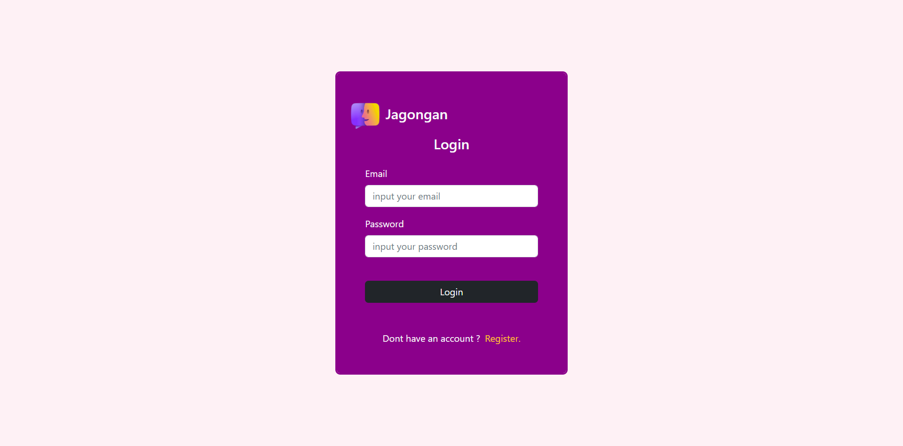
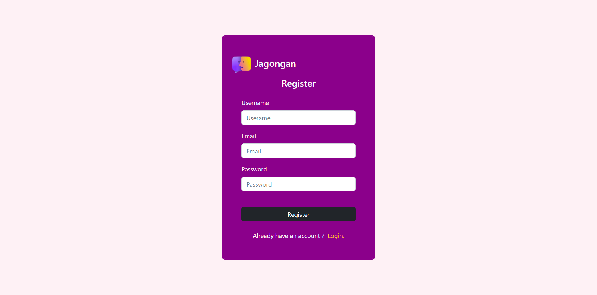
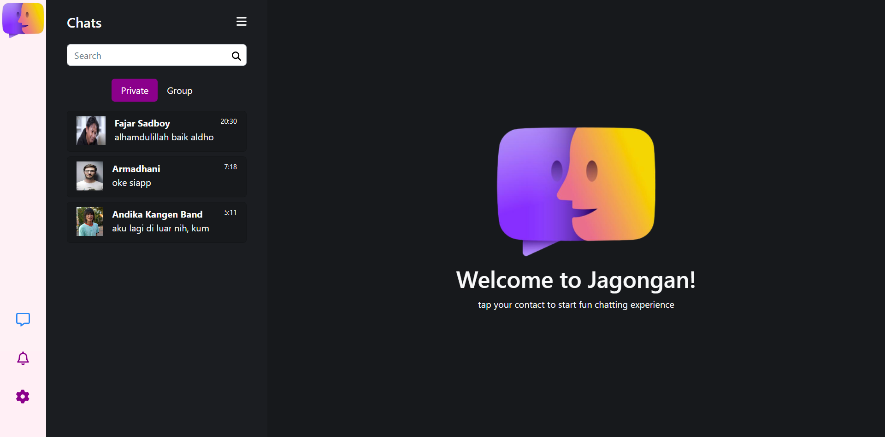
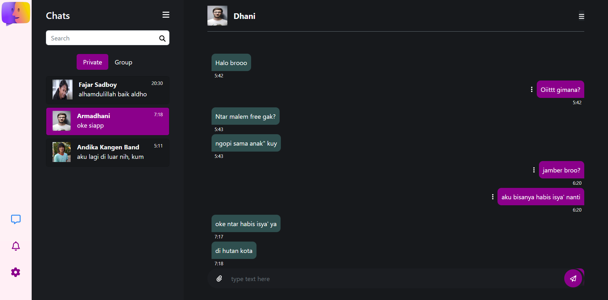

<p align="center">
<div align="center">
  
</div>
  <h3 align="center">Jagongan App</h3>
  <p align="center">
    <a href="https://github.com/RezaldhoArmadhani/Jagongan-FE"><strong>Explore the docs »</strong></a>
    <br />
    <a href="https://jagongan-fe.vercel.app/">View Demo</a>
    <br />
    <a href="https://jagongan-be-production.up.railway.app">Api Demo</a>
  </p>
</p>

<!-- TABLE OF CONTENTS -->

## Table of Contents

- [Table of Contents](#table-of-contents)
- [About The Project](#about-the-project)
  - [Built With](#built-with)
- [Getting Started](#getting-started)
  - [Prerequisites](#prerequisites)
  - [Installation](#installation)
  - [Setup .env](#setup-env)
- [Screenshots](#screenshots)
- [Contributing](#contributing)
- [Related Project](#related-project)
- [Contact](#contact)

<!-- ABOUT THE PROJECT -->

## About The Project

Jagongan adalah proyek situs web yang bertujuan untuk memfasilitasi komunikasi secara realtime antar pengguna yang terhubung. Dengan fitur obrolan yang mudah digunakan, pengguna dapat berkomunikasi satu sama lain dengan cepat dan efisien dalam bentuk teks. Pengguna dapat membuat akun dan dapat mengedit informasi akun seperti menambahkan foto, username, nomor telepon, dan bio.

<!-- GETTING STARTED -->

## Getting Started

### Prerequisites

This is an example of how to list things you need to use the software and how to install them.

- [nodejs](https://nodejs.org/en/download/)
- [Bootstrap Css](https://getbootstrap.com/)
- [React JS](https://reactjs.org/)
- [Redux](https://redux.js.org/)

### Installation

- Clone This Front End Repo

```
git clone https://github.com/RezaldhoArmadhani/Jagongan-FE
```

- Go To Folder Repo

```
cd ui
```

- Install Module

```
npm install
```

- <a href="#setup-env">Setup .env</a>
- Type ` npm run start` To Start Website

### Setup .env

Create .env file in your root project folder.

```
REACT_APP_ENDPOINT = [BACKEND_URL]
```

<!-- ROADMAP -->

## Screenshots

<table>
 <tr>
    <td></td>
    <td> </td>
  </tr>
   <tr>
    <td>Login</td>
    <td>Register</td>
  </tr>

  <tr>
    <td> </td>
     <td></td>
  </tr>
   <tr>
    <td>Landing</td>
    <td>Chat</td>
  </tr>
  <tr>
    <td> </td>
    <td></td>
  </tr>
   <tr>
    <td>Profile User</td>
    <td>Profile Friend</td>
  </tr>
</table>
<!-- CONTRIBUTING -->

## Contributing

Contributions are what make the open source community such an amazing place to be learn, inspire, and create. Any contributions you make are **greatly appreciated**.

1. Fork the Project
2. Create your Feature Branch (`git checkout -b feature/AmazingFeature`)
3. Commit your Changes (`git commit -m 'Add some AmazingFeature'`)
4. Push to the Branch (`git push origin feature/AmazingFeature`)
5. Open a Pull Request

## Related Project

:rocket: [`Backend Jagongan`](https://github.com/RezaldhoArmadhani/Jagongan-BE)

:rocket: [`Frontend Jagongan`](https://github.com/RezaldhoArmadhani/Jagongan-FE)

:rocket: [`Demo Jagongan`](https://jagongan-fe.vercel.app/)

Project Link: [https://github.com/RezaldhoArmadhani/Jagongan-FE](https://github.com/RezaldhoArmadhani/Jagongan-FE)
